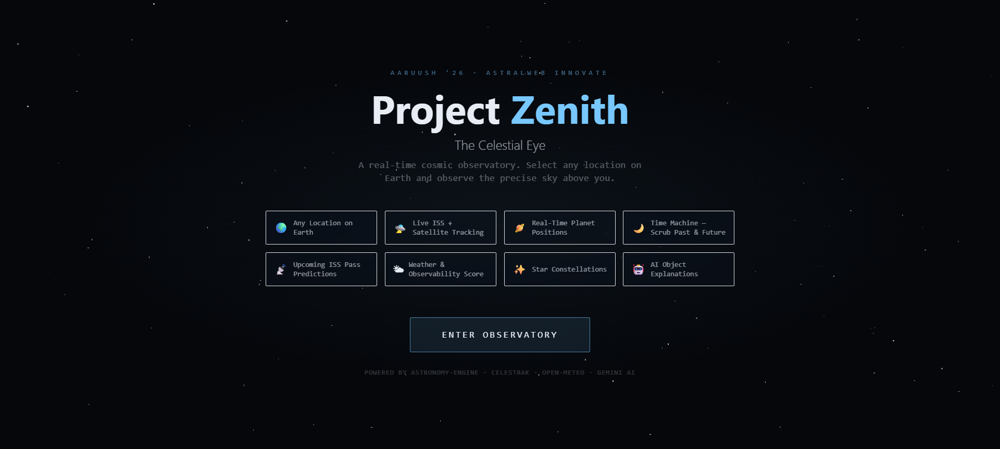
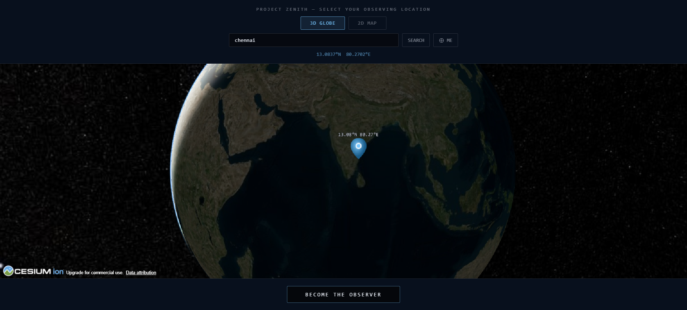
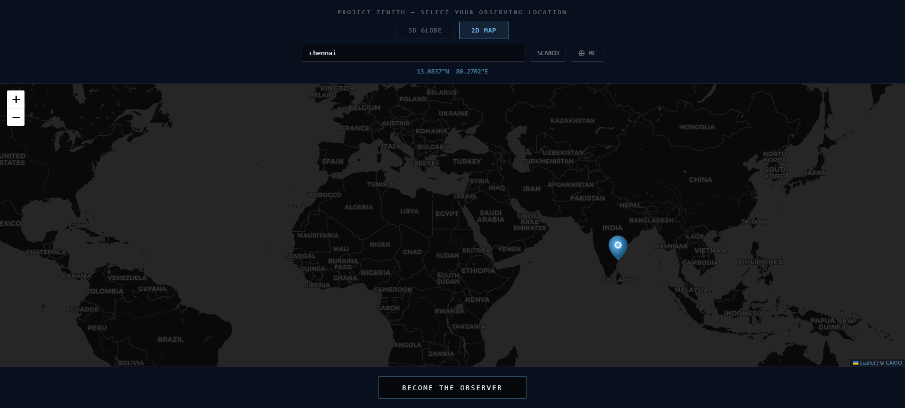
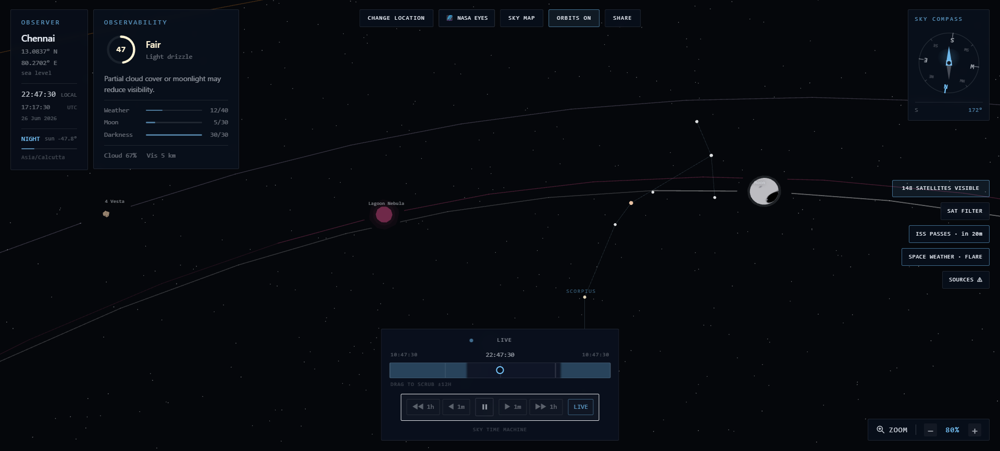
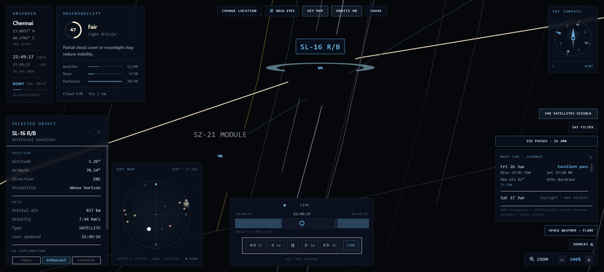
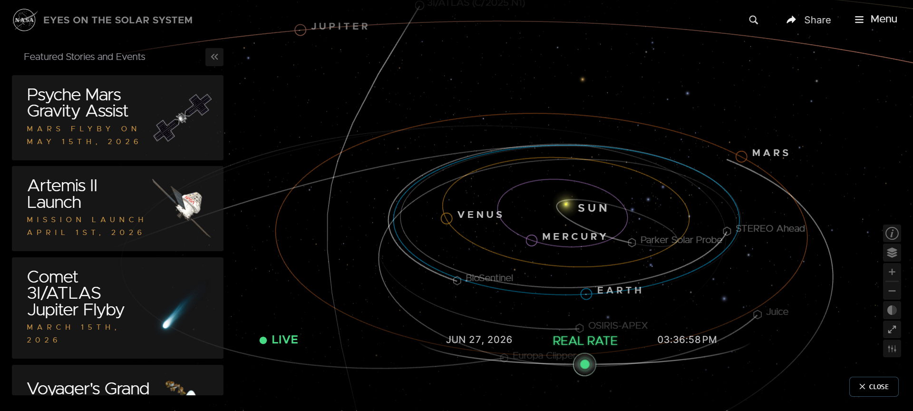
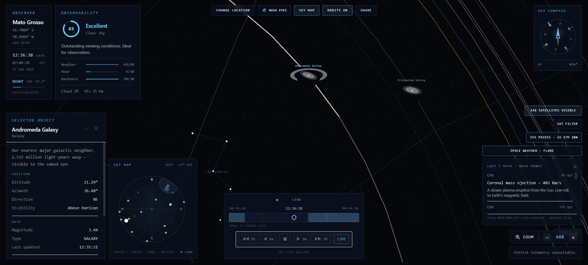
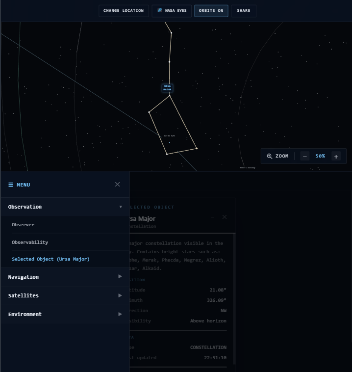
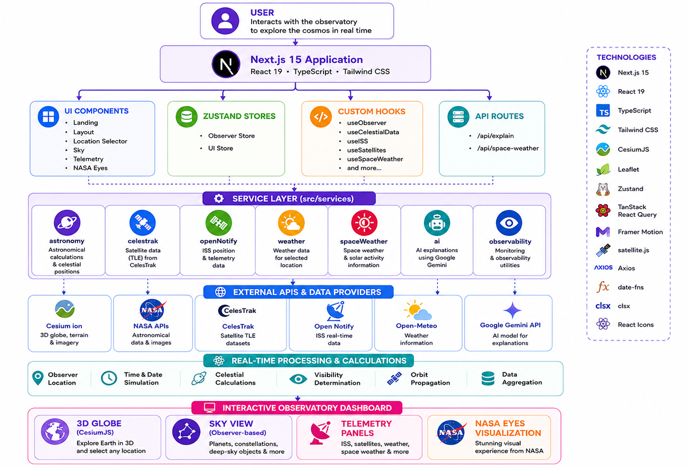

<div align="center">

# 🌌 Project Zenith: The Celestial Eye

### A Real-Time Cosmic Radar for Earth-Based Sky Observation

An immersive web application that enables users to explore the sky above any location on Earth in real time by visualizing satellites, the International Space Station (ISS), planets, constellations, deep-space objects, and space weather using live astronomical data.


</div>

---

## 🔗 Live Links

- **Website Live URL:** https://project-zenith-the-celestial-eye.vercel.app
- **GitHub Repository:** https://github.com/vishalinipg/project-zenith-the-celestial-eye

---

## 📑 Table of Contents

1. [Overview](#-overview)
2. [Round 2 Requirements Compliance](#-astralweb-innovate-2026--round-2-requirements-compliance)
3. [Screenshots](#-screenshots)
4. [Website Functionality & Unique Features ⭐](#-website-functionality--unique-features)
5. [Technology Stack & Dependencies ⭐](#-technology-stack--dependencies)
6. [Project Architecture](#-project-architecture)
7. [Project Structure](#-project-structure)
8. [Installation & Setup Instructions ⭐](#️-installation--setup-instructions)
9. [API Integrations](#-api-integrations)
10. [Performance Optimizations](#-performance-optimizations)
11. [Future Enhancements](#-future-enhancements)
12. [Contributors](#-contributors)
13. [License](#-license)
14. [Acknowledgements](#-acknowledgements)

---

# 📖 Overview

Project Zenith is a real-time astronomy web application developed for the AstralWeb Innovate 2026 Hackathon.

The platform allows users to select any location on Earth and instantly visualize the celestial objects visible from that position. By combining precise astronomical calculations with live space data, Project Zenith provides an interactive observatory experience directly in the browser.

Unlike traditional star maps, Project Zenith integrates a 3D globe, interactive sky visualization, live ISS tracking, active satellite positions, planetary rendering, constellation overlays, AI-powered explanations, and real-time space weather into a single unified dashboard.

The project emphasizes scientific accuracy, intuitive interaction, responsive design, and educational exploration for students, educators, astronomy enthusiasts, and curious learners.

---

# ✅ AstralWeb Innovate 2026 – Round 2 Requirements Compliance

Project Zenith has been developed as a submission for the **AstralWeb Innovate 2026 Hackathon (Round 2)**. The table below shows how the project satisfies the required evaluation criteria.

| Requirement                                | Status | Implementation                                                                              |
| ------------------------------------------ | :----: | ------------------------------------------------------------------------------------------- |
| Hosted Web Application                     |    ✅   | Deployed on Vercel                                                                          |
| Public GitHub Repository                   |    ✅   | Complete source code available                                                              |
| Interactive Map / 3D Globe                 |    ✅   | CesiumJS globe with Leaflet map support                                                     |
| Geographic Coordinate Selection            |    ✅   | Click any location to update observer coordinates                                           |
| Real-Time Celestial Visualization          |    ✅   | Observer-based sky rendering using live astronomical calculations                           |
| International Space Station (ISS) Tracking |    ✅   | Live ISS position and telemetry                                                             |
| Active Satellite Tracking                  |    ✅   | Satellite visualization using CelesTrak data                                                |
| Planet Visualization                       |    ✅   | Real-time planetary positions                                                               |
| Constellation Overlay                      |    ✅   | Constellations rendered relative to observer location                                       |
| Responsive User Interface                  |    ✅   | Optimized for desktop, tablet, and mobile devices                                           |
| Modern UI & CSS                            |    ✅   | Built with Tailwind CSS and responsive layouts                                              |
| Clean & Modular Codebase                   |    ✅   | Component-based architecture using Next.js and TypeScript                                   |
| Documentation                              |    ✅   | Comprehensive README with setup instructions, functionality, dependencies, and architecture |

---


# 📸 Screenshots

## 🖥️ Landing Page

The landing page introduces Project Zenith with a modern space-themed interface and provides quick access to the observatory.



---

## 🌐 Observatory Dashboard

### 🌍 CESIUM ion 3D Globe

Select any location on Earth using an interactive 3D globe powered by Cesium.



### 🗺️ Leaflet 2D Map

Choose observation coordinates through an interactive 2D map with synchronized location updates.



---

## 🌌 Interactive Sky View

Visualize planets, the Sun, the Moon with its changing phases, constellations, satellites, asteroids, galaxies, nebulae, and other deep-space objects visible from the selected location in real time.



---

## 🛰️ Live ISS Tracking

Track the International Space Station with real-time position updates and orbital information.



---

## 👁 NASA Eyes 3D View

Explore celestial objects through the integrated NASA Eyes visualization, providing an additional interactive perspective of the solar system and nearby space.



---

## 📱 Responsive Design

Project Zenith is fully responsive and provides a consistent user experience across desktop, tablet, and mobile devices.

### 🖥️ Desktop View

Optimized for large screens with a multi-panel observatory dashboard, interactive globe, and full-featured controls.



### 📟 Tablet View

Adaptive layout with touch-friendly controls, collapsible panels, and an optimized interface for medium-sized screens.



### 📱 Mobile View

A compact, mobile-first interface featuring a slide-out navigation menu, responsive panels, and touch-optimized interactions.


---

# 🚀 Website Functionality & Unique Features

This structure is much better because it mirrors your actual UI. I'd write it like this:

## 🌍 Location Selector

* Interactive **Cesium ion 3D Globe** with real-time day/night visualization
* **Leaflet 2D Map** for alternate location selection
* Search any city or place worldwide
* Use current device location
* Instant observer coordinate updates

## 📍 Observer

* Displays observer latitude and longitude
* Hemisphere and elevation information
* Local and UTC time
* Time zone detection
* Day/Night status
* Sun altitude relative to the observer

## 🌤 Observability

* Overall sky observability score
* Weather, moonlight, and darkness ratings
* Cloud cover and visibility distance
* Real-time observation condition summary

## 🔭 Selected Object

* Detailed information for the selected celestial object
* Altitude, azimuth, and compass direction
* Visibility status
* Object type and magnitude
* Live positional updates

## 🤖 AI Explanation & Ask About This

* AI-generated explanations for celestial objects
* Three explanation modes: **Simple**, **Enthusiast**, and **Technical**
* Ask follow-up astronomy questions for interactive learning

## 👁 NASA Eyes 3D View

* Embedded NASA Eyes visualization
* Interactive 3D space exploration
* Additional real-time celestial context

## 🌌 Sky Map

* Observer-centric real-time sky visualization
* Zenith and horizon reference
* Displays planets, constellations, satellites, galaxies, and deep-space objects
* Interactive celestial object rendering

## ⏳ Sky Time Machine

* Live sky simulation
* Pause and resume observations
* Drag timeline to scrub up to ±12 hours
* Minute and hour navigation controls
* Return instantly to the current live sky

## 🛰 Orbit Visualization

* Toggle satellite and ISS orbit paths on or off
* Visualize orbital trajectories on demand

## 🔗 Share Observation

* Generate and copy shareable observation links
* Quickly share the current observatory view

## 🛰 Visible Satellites

* Displays the total number of satellites currently visible
* Real-time satellite position updates

## 🎛 Satellite Filter

* Filter satellites by category:

  * Stations
  * Communications
  * Navigation
  * Weather
  * Science
  * Other

## 🛰 ISS Pass Predictions

* Predict upcoming ISS passes for the selected location
* Rise and set directions
* Maximum altitude
* Pass duration
* Visibility analysis based on daylight and observation conditions

## ☀️ Space Weather

* Displays recent solar activity using NASA DONKI data
* Provides current space weather conditions and update status

## 📡 Source Inspector

* Displays the status of all integrated data sources
* Indicates **Live**, **Fallback**, or **Demo Key** availability
* Supports Cesium Ion, CelesTrak, Open Notify, Open-Meteo, NASA DONKI, and Astronomy Engine

## 📱 Responsive User Experience

* Fully optimized for desktop, tablet, and mobile devices
* Adaptive layouts with touch-friendly controls
* Modern observatory dashboard with smooth animations
* Consistent experience across all screen sizes

---

# 🛠 Technology Stack & Dependencies

Project Zenith is built using modern web technologies focused on performance, scalability, and real-time astronomical visualization.

## Frontend

| Technology    | Purpose                    |
| ------------- | -------------------------- |
| Next.js 15    | Full-stack React framework |
| React 19      | User interface development |
| TypeScript    | Static type checking       |
| Tailwind CSS  | Responsive styling         |
| Framer Motion | Animations and transitions |

## Visualization & Mapping

| Technology | Purpose                      |
| ---------- | ---------------------------- |
| CesiumJS   | Interactive 3D globe         |
| Resium     | React integration for Cesium |
| Leaflet    | Interactive 2D maps          |

## Astronomy & Space Libraries

| Library          | Purpose                                     |
| ---------------- | ------------------------------------------- |
| Astronomy Engine | Planetary and celestial calculations        |
| satellite.js     | Satellite orbit propagation and positioning |

## State Management & Data Fetching

| Library              | Purpose                                      |
| -------------------- | -------------------------------------------- |
| Zustand              | Global state management                      |
| TanStack React Query | API caching and asynchronous data management |

## Utility Libraries

* Axios
* date-fns
* clsx
* React Icons

## Development Tools

* Node.js
* npm
* ESLint
* Vitest
* Git & GitHub

---

# 🏗 Project Architecture

Project Zenith follows a modular architecture that separates the user interface, astronomical calculations, API integrations, and application state into independent modules for better maintainability and scalability.



This modular structure keeps the application scalable while allowing each feature to evolve independently.

---

# 📂 Project Structure

The project follows a modular structure to keep the codebase organized, maintainable, and scalable.

```text
project-zenith-the-celestial-eye
├── public/
│   └── cesium/                # Cesium static assets
├── screenshots/               # README screenshots
├── scripts/                   # Utility scripts
├── src/
│   ├── app/                   # Next.js App Router
│   │   └── api/               # API routes
│   ├── components/            # Reusable UI components
│   │   ├── Landing/
│   │   ├── Layout/
│   │   ├── LocationSelector/
│   │   ├── NasaEyes/
│   │   ├── Sky/
│   │   └── Telemetry/
│   ├── constants/             # Application constants
│   ├── hooks/                 # Custom React hooks
│   ├── services/              # External API integrations
│   ├── stores/                # Zustand state stores
│   ├── types/                 # TypeScript types
│   └── utils/                 # Helper utilities
├── .gitignore
├── LICENSE
├── next.config.mjs
├── next-env.d.ts
├── package.json
├── package-lock.json
├── postcss.config.mjs
├── README.md
├── tailwind.config.ts
├── tsconfig.json
└── vitest.config.ts
```

---

# ⚙️ Installation & Setup Instructions

Follow the steps below to run Project Zenith locally.

## Prerequisites

Make sure the following software is installed:

* Node.js 20 or later
* npm
* Git

Verify your installation:

```bash
node -v
npm -v
git --version
```

## Clone the Repository

```bash
git clone https://github.com/vishalinipg/project-zenith-the-celestial-eye.git
```

```bash
cd project-zenith-the-celestial-eye
```

## Install Dependencies

```bash
npm install
```

## Configure Environment Variables

Create a `.env.local` file in the project root.

```env
NEXT_PUBLIC_CESIUM_ION_TOKEN=your_cesium_ion_token
GEMINI_API_KEY=your_gemini_api_key
AI_PROVIDER=gemini
```

> Replace the placeholder values with your own API keys before starting the application.

The application will not start correctly unless the required environment variables are configured.

## Start the Development Server

```bash
npm run dev
```

Open your browser and visit:

```text
http://localhost:3000
```

The application will automatically reload whenever source files are modified.

## Create a Production Build

```bash
npm run build
```

Run the production server:

```bash
npm start
```

## Run Lint Checks

```bash
npm run lint
```

## Run Tests

```bash
npm test
```

---

# 🌐 API Integrations

Project Zenith integrates multiple external services to provide accurate real-time astronomical data and interactive learning features.

| Service                          | Purpose                                                                       |
| -------------------------------- | ----------------------------------------------------------------------------- |
| **Cesium Ion**                   | 3D globe rendering, terrain, and global visualization                         |
| **Astronomy Engine**             | Observer-based astronomical calculations and planetary positions              |
| **CelesTrak**                    | Live satellite orbital data (TLE)                                             |
| **Open Notify**                  | International Space Station (ISS) position data                               |
| **Open-Meteo** | Current weather conditions for the selected observation location              |
| **Google Gemini**                | AI-generated explanations and educational information about celestial objects |

---

# ⚡ Performance Optimizations

Project Zenith incorporates several optimizations to ensure a smooth and responsive user experience.

* Dynamic imports for heavy components
* Lazy loading where appropriate
* Efficient global state management using Zustand
* Cached API requests with TanStack React Query
* Client-side rendering only for interactive visualization components
* Optimized React component rendering
* Responsive layouts for desktop, tablet, and mobile devices
* Modular architecture for easier maintenance and scalability

---

# 🚀 Future Enhancements

Project Zenith is designed with extensibility in mind. Planned enhancements include:

- [ ] 🔭 **Telescope Integration** – Connect compatible telescopes for real-time sky alignment and object tracking.
- [ ] 🥽 **Augmented Reality (AR) Sky View** – Overlay celestial objects onto the device camera for immersive sky exploration.
- [ ] 🌠 **Astronomical Event Alerts** – Receive notifications for meteor showers, eclipses, planetary conjunctions, and ISS flyovers.
- [ ] ☄️ **Near-Earth Object (NEO) Tracking** – Monitor asteroids and comets approaching Earth using NASA data.
- [ ] 📅 **Observation Planner** – Schedule observation sessions with personalized recommendations based on location and weather conditions.
- [ ] 📍 **Saved Observation Locations** – Save and quickly switch between frequently used observing locations.
- [ ] 📸 **Sky Snapshot & Sharing** – Capture and share the current sky visualization.
- [ ] 📊 **Observation Dashboard** – View observation history, tracked objects, and upcoming celestial events.

---

# 📄 License

This project was developed as part of the **AstralWeb Innovate 2026 Hackathon**.

The source code is licensed under the **MIT License**. See the `LICENSE` file for more information.

---

# 🙏 Acknowledgements

Project Zenith would not have been possible without the incredible open-source technologies, APIs, and communities that power modern web and astronomical applications.

Special thanks to:

* **NASA** – https://www.nasa.gov/
* **CesiumJS** – https://cesium.com/platform/cesiumjs/
* **Cesium ion** – https://cesium.com/platform/cesium-ion/
* **Astronomy Engine** – https://github.com/cosinekitty/astronomy
* **CelesTrak** – https://celestrak.org/
* **Open Notify** – http://open-notify.org/
* **Next.js** – https://nextjs.org/
* **React** – https://react.dev/
* **TypeScript** – https://www.typescriptlang.org/
* **Tailwind CSS** – https://tailwindcss.com/
* **Framer Motion** – https://motion.dev/
* **Leaflet** – https://leafletjs.com/
* **Resium** – https://resium.reearth.io/
* **Zustand** – https://zustand-demo.pmnd.rs/
* **TanStack React Query** – https://tanstack.com/query/latest
* **satellite.js** – https://github.com/shashwatak/satellite-js
* **Google Gemini API** – https://ai.google.dev/
* **Vercel** – https://vercel.com/
* **GitHub** – https://github.com/

---

<div align="center">

### 🌌 Project Zenith: The Celestial Eye

*A Real-Time Cosmic Radar for Earth-Based Sky Observation*

Made with ❤️ for **AstralWeb Innovate 2026**

</div>

---