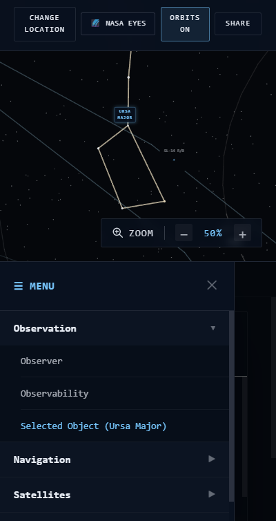

<div align="center">

# 🌌 Project Zenith: The Celestial Eye

### *A Real-Time Cosmic Radar for Earth-Based Sky Observation*

<p align="center">
An immersive, interactive web platform that enables users to explore the sky above any location on Earth in real time by visualizing satellites, the International Space Station (ISS), planets, constellations, and deep-space objects using live astronomical data.
</p>

---


</div>

---

# 📖 Overview

Project Zenith transforms astronomical observation into an intuitive and interactive web experience. Instead of relying on static star maps or isolated datasets, the platform functions as a **real-time celestial radar**, allowing users to select any geographic location on Earth and instantly discover what lies directly overhead.

The application combines modern web technologies with live astronomical telemetry to create an educational platform capable of visualizing satellites, planets, constellations, deep-space objects, and the International Space Station in an immersive environment.

Built using **Next.js**, **React**, **TypeScript**, **CesiumJS**, **Leaflet**, and multiple live astronomy APIs, Project Zenith emphasizes scientific accuracy, responsive design, and engaging user experience.

---

# 🎯 Problem Statement

Astronomy enthusiasts, educators, students, and curious explorers often struggle to understand what celestial objects are visible from a specific location at a given moment. Existing tools either focus on isolated datasets or require extensive astronomical knowledge.

Project Zenith bridges this gap by providing:

- 🌍 Interactive Earth coordinate selection
- 🛰️ Live satellite tracking
- 🛰️ Real-time ISS visualization
- 🪐 Planetary positioning
- ✨ Constellation overlays
- 🌌 Deep-space exploration
- 🕒 Time simulation and replay
- 📍 Observer-centric sky visualization

The result is an accessible, scientifically accurate platform that transforms complex astronomical information into an engaging visual experience.

---

# 🏆 AstralWeb Innovate Round 2

This project has been developed as a submission for the **AstralWeb Innovate 2026 Hackathon (Round 2)**.

The platform fulfills the primary challenge of creating an interactive, hosted web application that allows users to select any geographic coordinate on Earth and dynamically visualize celestial bodies currently passing overhead using real-time astronomical data.

---

# ✨ Highlights

- 🌍 Interactive 3D Globe
- 📍 Coordinate Selection
- 🛰️ Real-Time ISS Tracking
- 🛰️ Active Satellite Visualization
- 🪐 Planet Positioning
- ⭐ Constellation Overlay
- 🌌 Deep Space Objects
- ☀️ Space Weather Monitoring
- 🕒 Time Travel & Replay Controls
- 📈 Orbit Visualization
- 📊 Live Object Information
- 🤖 AI-powered Celestial Explanations
- 📱 Fully Responsive Design
- 🎨 Immersive Cosmic User Interface

---

# 📸 Screenshots

## 🖥️ Hero Landing Page


---

## 🌍 Observatory Dashboard


---

## 🌌 Interactive Sky View


---

## 🛰️ ISS Tracking


---

## 📱 Mobile Responsive View



---

# 📑 Table of Contents

- [Overview](#-overview)
- [Problem Statement](#-problem-statement)
- [AstralWeb Innovate Round 2](#-astralweb-innovate-round-2)
- [Project Highlights](#-highlights)
- [Feature Showcase](#-feature-showcase)
- [Round 2 Requirements Compliance](#-round-2-requirements-compliance)
- [Why Project Zenith?](#-why-project-zenith)
- [Technology Stack](#-technology-stack)
- [System Architecture](#-system-architecture)
- [Project Structure](#-project-structure)
- [Installation Guide](#-installation-guide)
- [Environment Variables](#-environment-variables)
- [API Integrations](#-api-integrations)
- [Application Workflow](#-application-workflow)
- [Performance Optimizations](#-performance-optimizations)
- [Responsive Design](#-responsive-design)
- [Screenshots](#-screenshots)
- [Future Enhancements](#-future-enhancements)
- [Acknowledgements](#-acknowledgements)

---

# 🚀 Feature Showcase

Project Zenith combines real-time astronomical computation, modern web technologies, and an immersive interface to provide a complete celestial observation platform.

---

## 🌍 Interactive Earth Exploration

- Interactive 3D globe for location selection
- Interactive 2D map support
- Click anywhere on Earth
- Latitude & longitude detection
- Observer location management
- Zoom and navigation controls
- Smooth globe interaction
- Real-time coordinate updates

---

## 🌌 Celestial Visualization

- Live sky visualization
- Zenith-based observation
- Planet rendering
- Deep-space object visualization
- Constellation overlays
- Celestial object labels
- Horizon-aware calculations
- Object visibility determination

---

## 🛰️ Satellite Tracking

- International Space Station tracking
- Active satellite visualization
- Satellite orbit rendering
- Live position updates
- Orbital information
- Speed tracking
- Satellite information panel

---

## 🪐 Astronomy Engine

- Accurate planetary positioning
- Observer-based calculations
- Time-dependent celestial positions
- Astronomical coordinate conversion
- Sky coordinate mapping

---

## ⏳ Time Controls

- Pause simulation
- Resume simulation
- Time replay
- Time acceleration
- Time rewind
- Jump to current time
- Manual date selection
- Simulation speed adjustment

---

## 📈 Observation Tools

- Object information panel
- Celestial metadata
- Observer information
- Compass widget
- Space weather monitoring
- Live environmental information

---

## 🤖 AI-Assisted Learning

- AI-powered celestial explanations
- Interactive astronomy assistance
- Educational object descriptions
- Context-aware information

---

## 📤 Sharing & Utilities

- Shareable observation links
- Calendar export
- Event scheduling support
- Observation bookmarking

---

## 🎨 User Experience

- Animated interface
- Responsive layouts
- Glassmorphism design
- Smooth transitions
- Loading animations
- Interactive panels
- Sidebar navigation
- Modern dashboard layout

---

## ⚡ Performance

- Lazy loading
- Component optimization
- Efficient state management
- Dynamic imports
- Optimized rendering
- Live data synchronization

---

# ✅ Round 2 Requirements Compliance

The following table demonstrates how Project Zenith satisfies the official Round 2 evaluation criteria.

| Requirement | Status | Implementation |
|------------|--------|----------------|
| Hosted Web Application | ✅ | Deployable Next.js application |
| Interactive Map / 3D Globe | ✅ | Interactive globe and map for coordinate selection |
| Geographic Coordinate Capture | ✅ | Click anywhere on Earth to observe the sky |
| Real-Time Celestial Data | ✅ | Live astronomical calculations and object updates |
| ISS Visualization | ✅ | Dedicated ISS tracking system |
| Active Satellite Tracking | ✅ | Satellite visualization and tracking |
| Planet Visualization | ✅ | Planetary position rendering |
| Constellation Display | ✅ | Constellation overlays |
| Responsive UI | ✅ | Mobile, tablet and desktop support |
| Advanced CSS | ✅ | Responsive layouts using modern CSS techniques |
| Real-Time Updates | ✅ | Dynamic data synchronization |
| Clean Codebase | ✅ | Modular architecture with reusable components |
| Public GitHub Repository | ✅ | Source code available |
| README Documentation | ✅ | Comprehensive project documentation |
| Blueprint Implementation | ✅ | Interactive observatory platform based on project concept |

---

# 🌟 Feature Richness

To exceed the minimum competition requirements, Project Zenith includes several advanced capabilities.

## Scientific Features

- Live orbital visualization
- Observer-centric calculations
- Dynamic sky positioning
- Accurate celestial rendering

---

## Interactive Features

- Time travel controls
- Replay system
- Live object information
- Interactive globe
- Dynamic map
- AI explanations

---

## Educational Features

- Astronomy learning interface
- Celestial body descriptions
- Scientific visualization
- Interactive exploration

---

## User Experience

- Responsive dashboard
- Modern UI animations
- Professional observatory layout
- Intuitive navigation

---

# 💡 Why Project Zenith?

Rather than functioning as a static star map, Project Zenith creates an immersive digital observatory where users can explore the sky from any location on Earth in real time.

The application combines:

- Scientific accuracy
- Interactive visualization
- Live astronomical data
- Responsive user experience
- Educational content
- Modern web technologies

This combination transforms complex astronomical datasets into an intuitive platform suitable for students, educators, astronomy enthusiasts, and curious explorers.

---

# 🏅 Competition Alignment

Project Zenith directly addresses every major objective outlined in the AstralWeb Innovate Round 2 challenge:

✅ Interactive coordinate selection

✅ Functional globe/map interface

✅ Dynamic celestial visualization

✅ Responsive design

✅ Modern user interface

✅ Real-time astronomical data

✅ Feature-rich implementation

✅ Clean project architecture

✅ Comprehensive documentation

By extending beyond the mandatory requirements with advanced visualization, educational tools, and enhanced user interaction, Project Zenith aims to deliver a complete real-time cosmic observation experience.

# 🛠 Technology Stack

Project Zenith is built using a modern full-stack JavaScript ecosystem optimized for performance, scalability, and scientific visualization.

---

## Frontend

| Technology | Purpose |
|------------|---------|
| Next.js 15 | Full-stack React framework with App Router |
| React 19 | Component-based UI development |
| TypeScript | Type-safe application development |
| Tailwind CSS | Utility-first responsive styling |
| Framer Motion | Smooth animations and transitions |

---

## Mapping & Visualization

| Technology | Purpose |
|------------|---------|
| CesiumJS | Interactive 3D Earth visualization |
| Resium | React wrapper for Cesium |
| Leaflet | Lightweight interactive 2D maps |
| React Three Fiber | Advanced 3D rendering support |

---

## Astronomy & Space Computation

| Library | Purpose |
|---------|---------|
| Astronomy Engine | Accurate planetary and celestial calculations |
| satellite.js | Satellite orbit propagation and positioning |

---

## State Management

| Library | Purpose |
|---------|---------|
| Zustand | Global application state management |
| TanStack React Query | Server-state management and API caching |

---

## Utilities

- Axios / Fetch API
- date-fns
- clsx
- React Icons
- Custom utility helpers

---

## Development Tools

- ESLint
- TypeScript Compiler
- npm
- Git
- GitHub

---

# 🏗 System Architecture

Project Zenith follows a modular architecture that separates presentation, business logic, astronomical calculations, API services, and global state management.

```text
                    User
                      │
                      ▼
           ┌─────────────────────┐
           │ Next.js Application │
           └─────────────────────┘
                      │
      ┌───────────────┼────────────────┐
      ▼               ▼                ▼

 UI Components    Global Stores     API Services

      │               │                │
      ▼               ▼                ▼

 Sky View       Observer State    NASA APIs

 Globe          Time Store        Satellite APIs

 Dashboard      UI Store          Weather APIs

      │
      ▼

 Astronomy Engine

      │
      ▼

 Celestial Calculations

      │
      ▼

Rendered Sky Visualization
```

---

# 📂 Project Structure

```text
Project-Zenith/

│
├── app/
│   ├── api/
│   ├── observatory/
│   ├── layout.tsx
│   └── page.tsx
│
├── components/
│   ├── globe/
│   ├── skyview/
│   ├── dashboard/
│   ├── nasa/
│   ├── controls/
│   ├── panels/
│   ├── ui/
│   └── shared/
│
├── hooks/
│
├── lib/
│   ├── astronomy/
│   ├── services/
│   ├── stores/
│   ├── utils/
│   └── constants/
│
├── public/
│
├── styles/
│
├── types/
│
├── tests/
│
├── package.json
│
└── README.md
```

---

# 🔄 Application Workflow

The platform follows a user-centric workflow designed to provide an intuitive astronomical observation experience.

### Step 1

User opens Project Zenith.

### Step 2

Interactive globe initializes.

### Step 3

User selects any location on Earth.

### Step 4

Observer coordinates are updated.


### Step 5

Astronomical calculations are performed.

### Step 6

Live APIs fetch celestial data.

### Step 7

Sky visualization updates instantly.

### Step 8

Dashboard panels display:

- ISS
- Satellites
- Planets
- Constellations
- Deep-space objects

### Step 9

User can:

- Change date/time
- Replay observations
- Track satellites
- Explore object information
- Share observations

---

# 📡 Data Flow

```text
User Interaction

        │
        ▼

Coordinate Selection

        │
        ▼

Observer Store

        │
        ▼

Astronomy Engine

        │
        ▼

API Services

        │
        ▼

Processed Celestial Data

        │
        ▼

Global State Update

        │
        ▼

Dashboard Components

        │
        ▼

Interactive Visualization
```

---

# 🧩 Component Architecture

The application is divided into reusable, independent components.

## Core Components

- Observatory Layout
- Globe Viewer
- Sky Viewer
- Dashboard
- Navigation
- Sidebar
- Floating Panels

---

## Visualization Components

- Planet Renderer
- Satellite Renderer
- ISS Renderer
- Orbit Renderer
- Constellation Renderer
- Deep Space Renderer

---

## Information Components

- Object Details Panel
- Observer Panel
- Space Weather Panel
- Compass Widget
- Time Controls

---

## Utility Components

- Loading Screen
- Error Boundary
- Notification System
- Dialog Components
- Shared UI Elements

---

# 🗄 State Management

Project Zenith uses **Zustand** for lightweight and scalable global state management.

Primary stores include:

- Observer Store
- Time Store
- UI Store
- Settings Store
- Celestial Object Store

This architecture enables efficient synchronization between the globe, sky visualization, and dashboard panels without unnecessary re-renders.

---

# ⚡ Performance Optimizations

Several optimization techniques have been implemented to ensure smooth rendering and responsiveness.

### Rendering

- Lazy-loaded components
- Dynamic imports
- Efficient React rendering
- Memoized calculations

---

### Data Handling

- Cached API requests
- Incremental updates
- Optimized polling
- Batched state updates

---

### User Experience

- Skeleton loaders
- Smooth page transitions
- Progressive rendering
- Responsive layouts

---

# 📱 Responsive Design

Project Zenith is designed with a mobile-first philosophy and adapts seamlessly across different screen sizes.

## Desktop

- Multi-panel observatory interface
- Full dashboard visibility
- Expanded controls
- Large 3D globe


---

## Tablet

- Optimized spacing
- Adaptive layouts
- Collapsible side panels
- Touch-friendly controls


---

## Mobile

- Responsive navigation drawer
- Compact dashboard
- Full-screen globe
- Bottom action controls
- Optimized touch gestures


---

# 🎯 Design Principles

The interface was designed around the following principles:

- Scientific accuracy
- Minimal cognitive load
- Immersive exploration
- Accessibility
- Cross-device compatibility
- High-performance rendering
- Modern cosmic aesthetics

# ⚙️ Installation Guide

Follow the steps below to set up Project Zenith on your local machine.

---

## 📋 Prerequisites

Before running the project, ensure the following software is installed:

| Software | Recommended Version |
|-----------|---------------------|
| Node.js | 20.x or later |
| npm | 10.x or later |
| Git | Latest Stable Version |

Verify your installation:

```bash
node -v
npm -v
git --version
```

---

# 📥 Clone Repository

```bash
git clone https://github.com/vishalinipg/project-zenith-the-celestial-eye.git
```

```bash
cd project-zenith-the-celestial-eye
```

---

# 📦 Install Dependencies

Using npm:

```bash
npm install
```

or

```bash
npm i
```

---

# 🔑 Environment Variables

Create a `.env.local` file in the project root.

```env
# Cesium
NEXT_PUBLIC_CESIUM_ION_TOKEN=

# NASA APIs
NASA_API_KEY=

# OpenAI / Gemini (if enabled)
AI_API_KEY=

# Weather API
WEATHER_API_KEY=

# Additional APIs
CELESTRAK_API=
OPEN_NOTIFY_API=
```

> ⚠️ Replace each placeholder with your own API keys before running the application.

---

# ▶️ Start Development Server

```bash
npm run dev
```

Open your browser:

```
http://localhost:3000
```

The application should now be running locally.

---

# 🏗 Production Build

Generate an optimized production build.

```bash
npm run build
```

Run the production server.

```bash
npm start
```

---

# 🧹 Linting

Run ESLint checks.

```bash
npm run lint
```

---

# 🧪 Testing

Execute all available tests.

```bash
npm test
```

If using Vitest:

```bash
npm run test
```

If using Playwright:

```bash
npm run test:e2e
```

---

# 🌍 Live Demo

## Hosted Application

[https://your-project-link.vercel.app](https://project-zenith-the-celestial-eye.vercel.app/)

---

# 📂 GitHub Repository

[https://github.com/vishalinipg/project-zenith-the-celestial-eye](https://github.com/vishalinipg/project-zenith-the-celestial-eye)

---

# 📡 API Integrations

Project Zenith combines multiple astronomy and space-related services to provide an accurate real-time observatory experience.

---

## 🛰 NASA Horizons

Purpose

- Planetary ephemeris
- Celestial positioning
- Astronomical calculations

Used For

- Planet positions
- Observation calculations
- Coordinate transformations

---

## 🛰 CelesTrak

Purpose

Provides real-time orbital element data.

Used For

- Active satellites
- Orbital calculations
- Satellite metadata

---

## 🛰 Open Notify

Purpose

Provides live International Space Station information.

Used For

- ISS location
- ISS visibility
- Current orbital position

---

## 🌦 Weather API

Purpose

Environmental conditions affecting sky observation.

Used For

- Cloud cover
- Temperature
- Visibility
- Atmospheric information

---

## 🤖 AI Service

Purpose

Generate educational explanations about celestial objects.

Used For

- Astronomy learning
- Object explanations
- Interactive assistance

---

# 🔄 Data Pipeline

```text
User selects location
        │
        ▼
Observer coordinates stored
        │
        ▼
Astronomy Engine calculates sky
        │
        ▼
External APIs queried
        │
        ▼
Celestial data processed
        │
        ▼
Global state updated
        │
        ▼
Dashboard & Sky View refreshed
```

---

# 🧠 Astronomical Calculations

Project Zenith performs observer-based astronomical calculations using precise geographic coordinates and time.

Calculations include:

- Planet positions
- Satellite visibility
- Zenith calculations
- Observer horizon
- Coordinate conversions
- Orbital propagation
- Celestial transformations

These computations ensure that displayed information accurately reflects the selected observation point.

---

# 📱 Cross-Platform Compatibility

| Device | Supported |
|----------|-----------|
| Desktop | ✅ |
| Laptop | ✅ |
| Tablet | ✅ |
| Mobile | ✅ |

The application is fully responsive and optimized for multiple screen sizes using modern CSS layout techniques.

---

# 🛠 Troubleshooting

## Globe Not Loading

Possible Causes

- Missing Cesium token
- Incorrect environment variables
- Network restrictions

---

## Satellite Data Missing

Possible Causes

- API unavailable
- Internet connection
- Rate limit exceeded

---

## ISS Not Updating

Possible Causes

- Live API unavailable
- Cached data
- Network timeout

---

## Build Errors

Try:

```bash
rm -rf node_modules
```

```bash
npm install
```

```bash
npm run build
```

---

# ❓ Frequently Asked Questions

### Does the application work offline?

No. Live astronomical data requires an internet connection.

---

### Can I observe any location on Earth?

Yes. Users can select virtually any geographic coordinate.

---

### Does the platform update in real time?

Yes. Celestial information is dynamically refreshed using astronomical calculations and live data sources.

---

### Is the application mobile friendly?

Yes. The interface is optimized for mobile, tablet, laptop, and desktop devices.

---

### Which browsers are supported?

- Google Chrome
- Microsoft Edge
- Mozilla Firefox
- Safari

# 📖 Complete Feature Walkthrough

Project Zenith is designed as an immersive digital observatory where users can explore the celestial sphere from any location on Earth. The application combines scientific accuracy, real-time data, and modern web technologies into an intuitive workflow.

---

# 🏠 Landing Page

The landing page introduces Project Zenith with an immersive space-themed interface that highlights the application's purpose and encourages users to begin exploring the cosmos.

### Highlights

- Hero section
- Animated cosmic background
- Project overview
- Feature highlights
- Call-to-action button
- Responsive layout

---

# 🌍 Observatory Dashboard

The Observatory Dashboard serves as the application's central workspace.

Users can simultaneously observe Earth, space, and live astronomical information.

### Dashboard Includes

- Interactive Globe
- Sky View
- Object Information
- Time Controls
- Observer Panel
- Navigation
- Quick Actions

---

# 🌎 Interactive Globe

Users can freely rotate, zoom, and navigate the Earth before selecting any observation location.

Features

- 3D Earth
- Zoom
- Rotation
- Location Selection
- Coordinate Display
- Smooth Navigation

---

# 🗺 Interactive Map

Alternative 2D map interface for selecting observation coordinates.

Features

- Pan
- Zoom
- Click Selection
- Marker Placement
- Coordinate Capture

---

# 📍 Observer Location

Displays information about the selected observation point.

Includes

- Latitude
- Longitude
- Elevation (if available)
- Local Time
- UTC Time
- 
---

# 🌌 Sky View

Displays the celestial sphere above the selected location.

Users can observe:

- Planets
- Stars
- Constellations
- Satellites
- ISS
- Deep-space objects

---

# 🛰 International Space Station

Live tracking of the International Space Station.

Displayed Information

- Current Position
- Speed
- Altitude
- Latitude
- Longitude
- Orbital Path

---

# 🛰 Satellite Tracking

Visualizes active satellites currently observable.

Features

- Satellite Labels
- Live Position
- Orbit Visualization
- Speed Information

---

# 🪐 Planetary View

Displays planets visible from the selected observation point.

Information Includes

- Planet Name
- Position
- Visibility
- Direction
- Elevation

---

# ✨ Constellation Overlay

Interactive constellation rendering enhances sky exploration.

Features

- Constellation Names
- Connecting Lines
- Visibility
- Observer-relative positioning

---

# 🌠 Deep Space Objects

Visualization of distant astronomical objects.

Examples

- Galaxies
- Nebulae
- Star Clusters

---

# 📈 Orbit Visualization

Displays orbital paths for satellites and the ISS.

Features

- Orbit Curves
- Live Movement
- Observer Reference

---

# ⏳ Time Controls

Allows users to simulate observations at different times.

Available Controls

- Play
- Pause
- Rewind
- Fast Forward
- Speed Adjustment
- Jump to Present

---

# 🧭 Compass Widget

Displays observer orientation.

Includes

- North
- South
- East
- West
- Heading Indicator

---

# 🌤 Space Weather Panel

Provides additional environmental context.

Information

- Weather
- Visibility
- Temperature
- Atmospheric Conditions

---

# 📊 Celestial Object Details

Detailed information panel for the selected object.

Includes

- Name
- Category
- Distance
- Position
- Magnitude
- Description

---

# 🤖 AI Astronomy Assistant

Provides educational explanations about celestial objects.

Capabilities

- Explain planets
- Explain satellites
- Scientific facts
- Interactive responses

---

# 🔗 Share Feature

Generate shareable observation links.

Supports

- URL Sharing
- Clipboard Copy
- Social Sharing

---

# 📅 Calendar Export

Export celestial events.

Supports

- Calendar integration
- Observation reminders

---

# 📱 Mobile Experience

Project Zenith is fully optimized for smartphones.

Optimizations

- Drawer Navigation
- Responsive Layout
- Touch Gestures
- Compact Controls

---

# 📟 Tablet Experience

Designed specifically for medium-sized displays.

Features

- Adaptive Panels
- Optimized Controls
- Responsive Grid

---

# 🖥 Desktop Experience

Provides the complete observatory experience.

Features

- Full Dashboard
- Multiple Panels
- Large Globe
- Enhanced Visualization

---

# 🏆 AstralWeb Round 2 Compliance Checklist

| Requirement | Status |
|------------|--------|
| Hosted Web Application | ✅ |
| Public GitHub Repository | ✅ |
| Comprehensive README | ✅ |
| Interactive 3D Globe | ✅ |
| Interactive Map | ✅ |
| Coordinate Selection | ✅ |
| Real-Time Celestial Visualization | ✅ |
| ISS Tracking | ✅ |
| Satellite Tracking | ✅ |
| Planet Visualization | ✅ |
| Constellation Overlay | ✅ |
| Responsive Mobile UI | ✅ |
| Responsive Tablet UI | ✅ |
| Responsive Desktop UI | ✅ |
| Modern CSS Layout | ✅ |
| Clean Code Structure | ✅ |
| Documentation | ✅ |

---

# 🚀 Future Enhancements

Potential future improvements include:

- Augmented Reality sky mode
- Virtual Reality observatory
- Telescope integration
- Night mode optimization
- Voice commands
- Multi-user observation sessions
- Observation history
- Personalized celestial events
- AI observation recommendations
- Meteor shower notifications
- Eclipse prediction
- Offline star catalog

---

# 📜 License

This project is developed exclusively for the **AstralWeb Innovate 2026 Hackathon**.

You may choose to release the project under the **MIT License** or another open-source license after the competition.

---

# ⭐ If you enjoyed this project

Please consider giving the repository a ⭐ on GitHub.

It motivates further development and helps others discover the project.

---

<div align="center">

## 🌌 Thank You

### *Project Zenith: The Celestial Eye*

**Turning Real-Time Astronomical Data into an Interactive Cosmic Experience.**

Made with ❤️ for **AstralWeb Innovate 2026**

</div>
